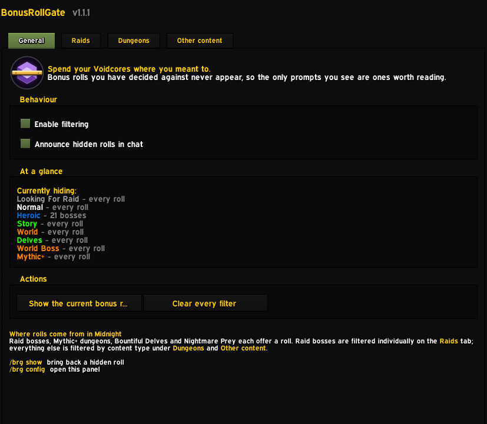
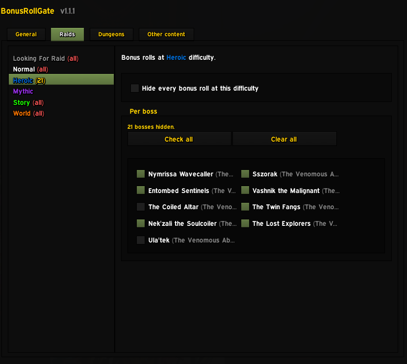
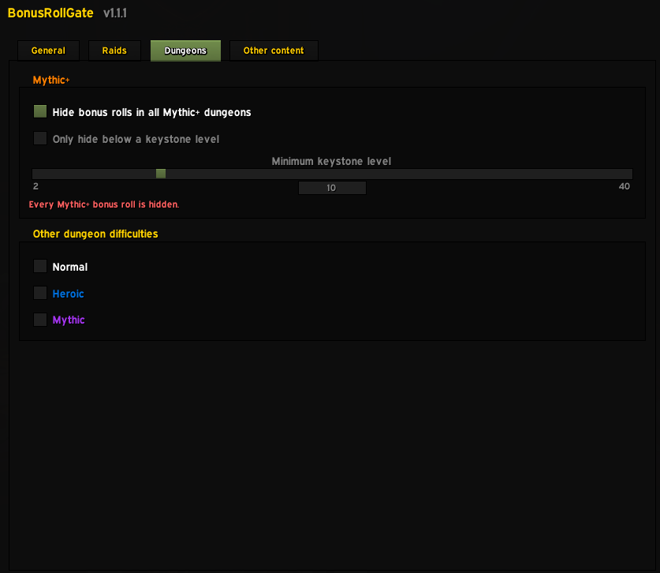

# BonusRollGate

Hides the World of Warcraft bonus roll prompt for the bosses, difficulties and
content types you don't want to spend Voidcores on.

Midnight's Voidforge gives you a limited number of Nebulous Voidcores each week,
and a roll prompt pops for raid bosses, Mythic+ dungeons, Bountiful Delves and
Nightmare Prey alike. BonusRollGate keeps the prompt out of your way for the
content you've decided not to spend on, so the only prompts you see are ones
you might actually take.

## Features

- **Per-boss filtering for raids.** Every raid difficulty — LFR, Normal, Heroic,
  Mythic, Story and World — gets its own boss list plus a "hide everything at
  this difficulty" switch. Each list holds only the bosses that difficulty is
  actually offered at.
- **Boss lists build themselves.** Encounters come from the Encounter Journal at
  runtime instead of a hardcoded table, so a new raid tier needs no addon update.
  The lists cover the current tier, which is where bonus rolls come from, and
  the journal's world bosses are kept out of them. Anything the addon is actually
  offered a roll on is remembered and added to the options too, so nothing falls
  off the list.
- **Mythic+ keystone threshold.** Hide rolls in all Mythic+ dungeons, or only
  below a keystone level you pick.
- **Delves, prey, dungeons and world bosses** each get their own switch. Prey covers Normal, Hard and Nightmare hunts in one tick, because the
  prompt does not say which hunt it came from.
- **Nothing is lost.** A hidden roll is only hidden — `/brg show` brings it back
  as long as the timer hasn't run out.

## Screenshots

### General

The master switch, the chat announcement toggle, and an "At a glance" panel that
lists every filter currently in force — whole difficulties and boss counts
together — so you never have to open each page to find out what is being hidden.
"Clear every filter" resets the lot behind a confirmation.



### Raids

Each raid difficulty is its own page. The sidebar doubles as a summary: `all`
means every roll at that difficulty is hidden, a number means that many
individual bosses are. Bosses come from the Encounter Journal, and each list
holds only the bosses that difficulty is actually offered at — so a one-boss
instance run at World, Normal, Heroic and Mythic stays off the Looking For Raid
list.



### Dungeons

Mythic+ can be hidden outright or only below a keystone level you pick, so the
+2 you ran for the weekly stops prompting while your real keys still do. Normal,
Heroic and Mythic dungeons get plain switches underneath.



## Commands

| Command | Effect |
| --- | --- |
| `/brg` | Open the settings panel and list these commands |
| `/brg config` | Open the settings panel |
| `/brg show` | Bring back a roll that was hidden |
| `/brg hide` | Hide the bonus roll showing right now |
| `/brg toggle` | Turn filtering on or off |
| `/brg status` | List what is currently filtered |
| `/brg last` | Describe the last roll the addon saw |
| `/brg help` | List these commands |

`/bonusrollgate` works anywhere `/brg` does.

## Installation

Download from CurseForge, or clone this repository directly into
`World of Warcraft/_retail_/Interface/AddOns/BonusRollGate`. The Ace3 libraries
are vendored in `Libs/`, so a clone works as-is with no build step. The options
window is hand-written and pulls in no config library.


## Support

Would love any feedback, further ideas or bug reports.

Bugs, questions and ideas all go to Discord: **https://discord.gg/zHT3bGEQ52**

`#support` for bugs and help, `#ideas` for feature requests, `#announcements`
for release notes.

A bug report gets fixed faster with:

```
Addon version:      (from /brg status)
Game version:       (bottom of the character select screen)
What I expected:
What happened:
Steps to reproduce:
Lua error (if any):
```

`/brg status` prints the version and every filter currently in force, which is
usually the whole diagnosis. If there is a Lua error, paste the full text from
BugSack rather than the first line.


## Credits

BonusRollGate is descended from [BonusRollFilter](https://github.com/chawan/BonusRollFilter)
by Chawan, which was released into the public domain and last updated in January
2020. The filtering logic and options UI have since been rewritten for Midnight
12.1; the debt is to the original idea and to six years of it working well.

## License

MIT — see [LICENSE](LICENSE).
